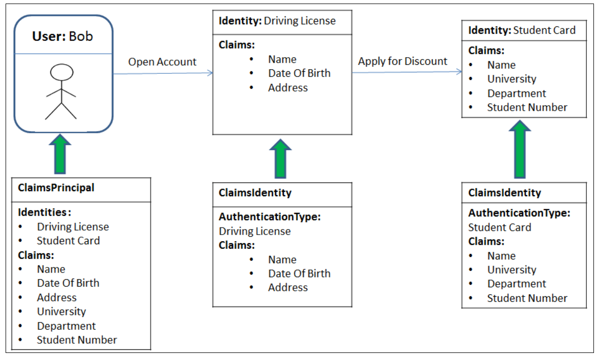

# Identity in ASP.NET Core
[source](https://www.youtube.com/watch?v=sogS0DtejVA&ab_channel=FrankLiu)

--- ---

## Dependencies

- Entity Framework Core
- Entity Framework Tools
- Entity Framework SqlServer

--- ---

## User Identity Workflow 

- Sign-up/log-in page
- cookie base authentication/token base authentication
- security context is stored in either cookie or token
- user information is stored in database, credentials needs to be checked against stored data
- After credentials verification, **_security is generated_** which is serialized into either cookie or web token
- cookie/token is stored in both **_server and browser_**
- security context is serialized back and forth b/w browser and **_server_**

--- ---

## ASP.NET Core Basics

- Create cross-platform application (both Web API, and Web)
- **_Middleware Pipeline_**: (authentication, authorization, etc). Each http request must pass through middleware one by one when it is coming or going back

--- ---

## Security Context

- Security context stores all the information that user has for security purpose
- All this infromation is stored in one single object called **_claims principles_** 
- **_claims principles_** also called **_Principle_** contain one or more identities of user

- **_Principle_** present **_logged in user_**

--- ---

## Authorization Architecture

- 

--- ---