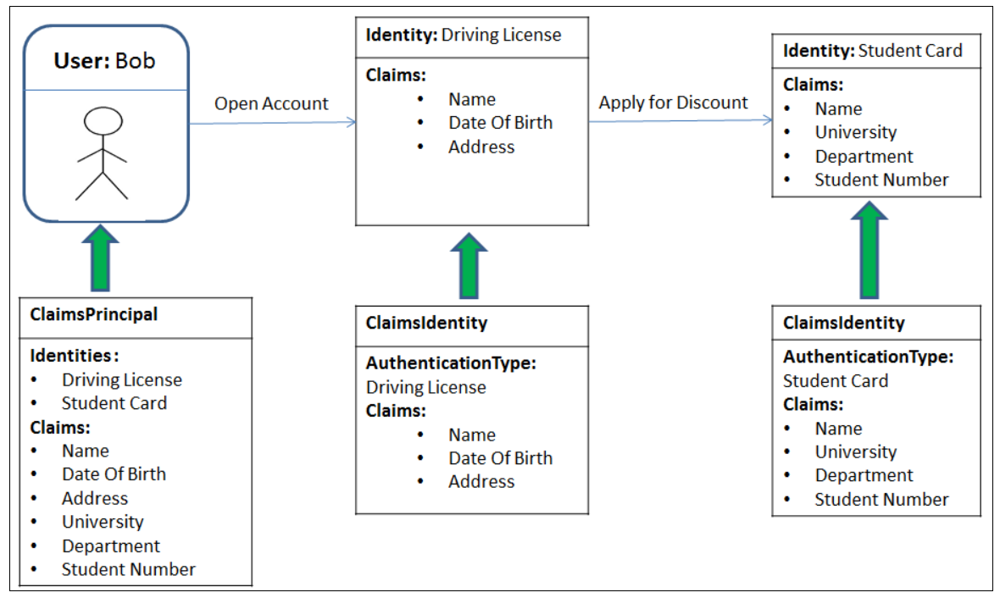

# Identity in ASP.NET Core
[source](https://www.youtube.com/watch?v=sogS0DtejVA&ab_channel=FrankLiu)

--- ---

## Dependencies

- Entity Framework Core
- Entity Framework Tools
- Entity Framework SqlServer

--- ---

## User Identity Workflow 

- Sign-up/log-in page
- cookie base authentication/token base authentication
- security context is stored in either cookie or token
- user information is stored in database, credentials needs to be checked against stored data
- After credentials verification, **_security is generated_** which is serialized into either cookie or web token
- cookie/token is stored in both **_server and browser_**
- security context is serialized back and forth b/w browser and **_server_**


--- ---

## ASP.NET Core Basics

- Create cross-platform application (both Web API, and Web)
- **_Middleware Pipeline_**: (authentication, authorization, etc). Each http request must pass through middleware one by one when it is coming or going back

--- ---

## Security Context

- Security context stores all the information that user has for security purpose
- All this infromation is stored in one single object called **_claims principles_** 
- **_claims principles_** also called **_Principle_** contain one or more identities of user



- **_Principle_** present **_logged in user_**

--- ---

## Authorization Architecture

- **_DbContext_** will look like this

```c#
using IdentityProject.Models;
using Microsoft.AspNetCore.Identity.EntityFrameworkCore;
using Microsoft.EntityFrameworkCore;

namespace IdentityProject.Data
{
    public class ApplicationDbContext: IdentityDbContext<DefaultUser>
    {
        public ApplicationDbContext(DbContextOptions options): base(options)
        {
        }
        // This is where we will be adding the Models
        DbSet<Books> books { get; set; }
    }
}

```

- After that use **_scafolding_** to add **_identity_** to the project

```c#
using Microsoft.EntityFrameworkCore;
using Microsoft.AspNetCore.Identity;
using IdentityProject.Data;

var builder = WebApplication.CreateBuilder(args);

// Add services to the container.
builder.Services.AddControllersWithViews();
builder.Services.AddDbContext<IdentityProject.Data.ApplicationDbContext>(
    options => options.UseSqlServer(builder.Configuration.GetConnectionString("DefaultConnection"))
    );

// Identity Db Context has been added
builder.Services.AddDefaultIdentity<IdentityProject.Models.DefaultUser>(options => options.SignIn.RequireConfirmedAccount = true)
    .AddEntityFrameworkStores<ApplicationDbContext>();

var app = builder.Build();

// These are the middlewares
// Configure the HTTP request pipeline.
if (!app.Environment.IsDevelopment())
{
    app.UseExceptionHandler("/Home/Error");
    // The default HSTS value is 30 days. You may want to change this for production scenarios, see https://aka.ms/aspnetcore-hsts.
    app.UseHsts();
}

app.UseHttpsRedirection();
app.UseStaticFiles();
app.UseRouting();
app.UseAuthorization();
app.UseAuthentication();

app.MapControllerRoute(
    name: "default",
    pattern: "{controller=Home}/{action=Index}/{id?}");

app.MapRazorPages();
app.Run();
```
- Apply migrations to update the database

```bash
add-migration "message"
update-database
```

--- ---